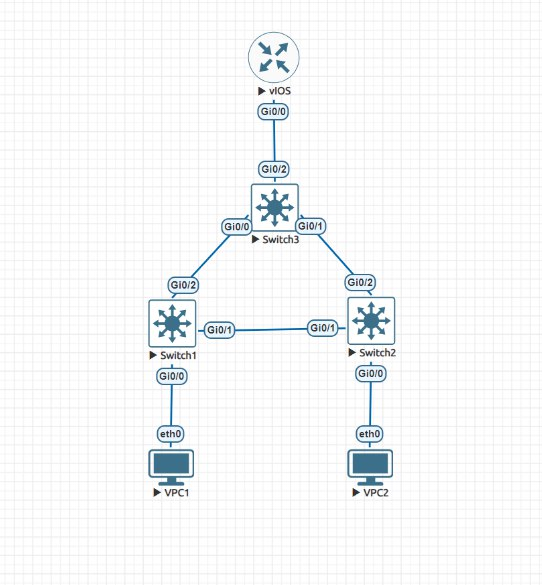
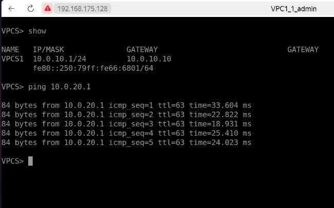
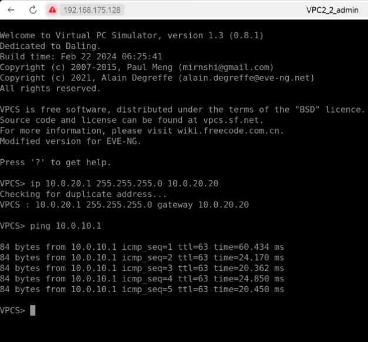
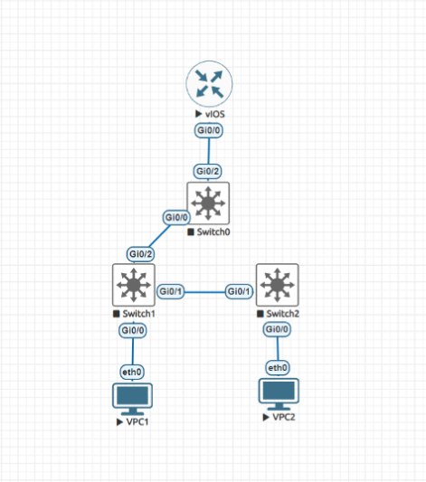
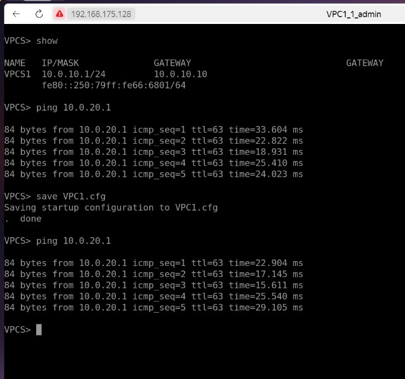
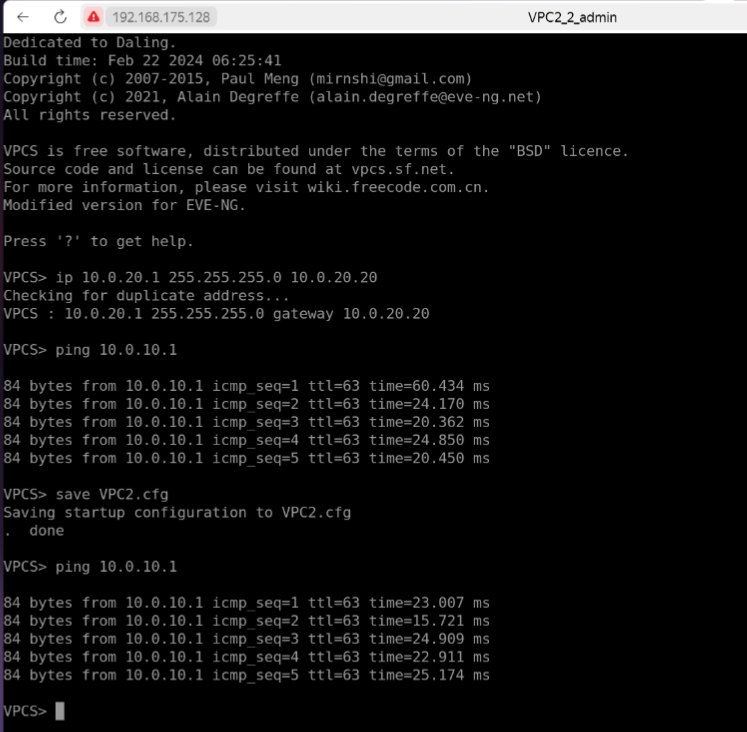

# Homework 1

Домашнее задание 1



## Настройка VPC1/2
```
VPC1: ip 10.0.10.1 255.255.255.0 10.0.10.10
VPC2: ip 10.0.20.1 255.255.255.0 10.0.20.20
```

## Настройка SWITCH0
- switchport trunk encapsulation dot1q — устанавливает тип инкапсуляции транка.
- switchport mode trunk — переключает порт в режим транка.
- switchport trunk allowed vlan 10,20 — ограничивает VLAN, которые могут передаваться через транк, только VLAN 10 и 20.
- с помощью spanning-tree SWITCH0 стал корневым мостом для VLAN 10 и 20.
```
enable
    configure terminal
        vlan 10, 20
        exit
    interface gi0/0
        switchport trunk encapsulation dot1q
        switchport mode trunk
        switchport trunk allowed vlan 10,20
        exit
    interface gi0/1
        switchport trunk encapsulation dot1q
        switchport mode trunk
        switchport trunk allowed vlan 10,20
        exit
    interface e0/2
        switchport trunk encapsulation dot1q
        switchport mode trunk
        switchport trunk allowed vlan 10,20
        exit
    spanning-tree vlan 10 root primary
    spanning-tree vlan 20 root primary
    exit
```

## Настройка SWITCH1
```
enable
    configure terminal
        vlan 10, 20
        exit
    interface gi0/0
        switchport mode access
        switchport access vlan 10
        exit
    interface gi0/1
        switchport trunk encapsulation dot1q
        switchport mode trunk
        switchport trunk allowed vlan 10,20
        exit
    interface e0/2
        switchport trunk encapsulation dot1q
        switchport mode trunk
        switchport trunk allowed vlan 10,20
        exit
    exit
```


## Настройка SWITCH2
```
enable
    configure terminal
        vlan 10, 20
        exit
    interface gi0/0
        switchport mode access
        switchport access vlan 20
        exit
    interface gi0/1
        switchport trunk encapsulation dot1q
        switchport mode trunk
        switchport trunk allowed vlan 10,20
        exit
    interface e0/2
        switchport trunk encapsulation dot1q
        switchport mode trunk
        switchport trunk allowed vlan 10,20
        exit
    exit
```


## Настройка Router
```
enable
    configure terminal
    interface gi0/0
        no shutdown
        exit
    interface e0/0.10
        encapsulation dot1Q 10
        ip address 10.0.10.42 255.255.255.0
        exit
    interface e0/0.20
        encapsulation dot1Q 20
        ip address 10.0.20.42 255.255.255.0
        exit
    exit
```


## Пингуем хосты в текущей конфигурации

# VPC1



# VPC2




## убрал линк Gi0/2 <-> Gi0/0




## Пингую еще раз

# VPC1



# VPC2

